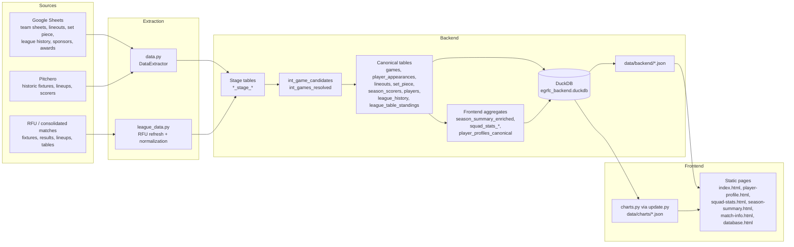

# Backend and Website Update Guide

This guide explains how the EGRFC stats backend is put together, which scripts do what, how data flows into the website, and how to rebuild, test, and publish the site after updating data.

## 1. What the backend does

The backend combines several rugby data sources into a canonical DuckDB database and a set of JSON exports for the static website.

Main source systems:

- **Google Sheets** — primary operational source for games, team sheets, lineouts, set piece data, league history, sponsors, and awards
- **Pitchero** — historic fixtures, lineups, and some scorer data
- **RFU data** — league fixtures, scores, tables, and lineups where available

Main outputs:

- `/home/runner/work/egrfc-stats/egrfc-stats/data/egrfc_backend.duckdb`
- `/home/runner/work/egrfc-stats/egrfc-stats/data/backend/*.json`
- `/home/runner/work/egrfc-stats/egrfc-stats/data/charts/*.json`

These outputs are then consumed by the static HTML/JavaScript pages in the repository root and `/home/runner/work/egrfc-stats/egrfc-stats/js`.

## 2. Main scripts and their roles

### `/home/runner/work/egrfc-stats/egrfc-stats/python/data.py`

Contains the `DataExtractor` class, which reads from Google Sheets and handles some upstream scraping logic.

Key methods:

- `extract_games_data()` — reads match-level game rows from the team sheets
- `extract_player_appearances()` — reads player appearance rows from the team sheets
- `extract_lineouts_data()` — reads the `Lineouts` sheet into event-level lineout rows
- `extract_set_piece_stats()` — reads set piece and red-zone values
- `extract_league_history()` — reads league metadata and RFU identifiers
- `extract_sponsors()` — reads player sponsors
- `extract_awards()` — reads end-of-season awards
- `extract_pitchero_stats()` — reads or scrapes Pitchero season stats
- `extract_pitchero_historic_team_sheets()` — scrapes historic Pitchero fixtures and lineups

### `/home/runner/work/egrfc-stats/egrfc-stats/python/league_data.py`

Builds and refreshes RFU-derived data.

Key functions:

- `build_rfu_games_dataframe()` — normalizes RFU match records
- `build_rfu_player_appearances_dataframe()` — normalizes RFU lineup data
- `get_active_season_squad_pairs()` — works out which season/squad pairs should be refreshed
- `update_league_data()` — refreshes one RFU season/squad
- `update_multiple_seasons_and_squads()` — refreshes several RFU season/squad combinations
- `build_league_tables_json()` — exports league table JSON for the frontend
- `get_current_season_label()` and `normalize_season_arg()` — support CLI refresh selection

### `/home/runner/work/egrfc-stats/egrfc-stats/python/backend.py`

Owns the canonical backend model.

Key objects/functions:

- `BackendConfig` — file-path configuration for the backend
- `BackendDatabase` — main builder/orchestrator class
- `BackendDatabase.build()` — main canonical backend build
- `BackendDatabase.rebuild_post_enrichment()` — rebuilds scorer-dependent tables after optional enrichment
- `BackendDatabase.create_views()` — creates SQL views used for summaries and diagnostics
- `BackendDatabase.export_tables()` — exports backend tables/views to JSON
- `build_backend()` — top-level helper used by the CLI

Important internal build methods:

- `_build_games()`
- `_build_player_appearances()`
- `_build_lineouts()`
- `_build_set_piece()`
- `_build_season_scorers()`
- `_build_players()`
- `_build_season_summary()`
- `_build_squad_stats()`
- `_build_squad_position_profiles()`
- `_build_squad_continuity()`

### `/home/runner/work/egrfc-stats/egrfc-stats/python/build_backend.py`

Small CLI wrapper around `build_backend()`. Use this when you want to build the canonical backend only.

### `/home/runner/work/egrfc-stats/egrfc-stats/python/update.py`

Operational entry point for a full refresh.

`main(...)` does the following:

1. refreshes RFU data if enabled
2. builds the canonical backend
3. syncs headshots
4. regenerates chart specs
5. exports league-table JSON for the site

Use this script when you want a normal website data refresh.

## 3. Canonical backend tables

The most important canonical tables are:

- `games` — one row per EGRFC game
- `player_appearances` — one row per player per game
- `lineouts` — one row per lineout event
- `set_piece` — one row per team per game
- `season_scorers` — per-player scoring totals by season/game type
- `players` — player master data and career aggregates
- `league_history` — season/squad league metadata and RFU ids
- `league_table_standings` — table positions and league performance by team

Frontend-ready aggregate tables include:

- `season_summary_enriched`
- `squad_stats_enriched`
- `squad_position_profiles_enriched`
- `squad_continuity_enriched`
- `squad_stats_with_thresholds_enriched`
- `player_profiles_canonical`

There are also staging and audit tables such as:

- `games_stage_google`, `games_stage_pitchero`, `games_stage_rfu`
- `player_appearances_stage_google`, `player_appearances_stage_pitchero`, `player_appearances_stage_rfu`
- `scorers_stage_google`, `scorers_stage_pitchero`, `scorers_stage_rfu`
- `int_game_candidates`
- `int_games_resolved`

These are useful for tracing how source data is resolved into canonical outputs.

## 4. Data flow diagram



## 5. What the website depends on

### Backend JSON exports

Pages and frontend modules fetch data from `/home/runner/work/egrfc-stats/egrfc-stats/data/backend/`.

Examples:

- `player_profiles_canonical.json` → player gallery and player profile pages
- `games.json` and `player_appearances.json` → match, player, and opposition pages
- `set_piece.json` and `lineouts.json` → set piece and lineout analysis
- `season_summary_enriched.json` → season-level summary content
- `squad_*_enriched.json` → squad stats pages
- `league_history.json` and `league_table_standings.json` → league context and data explorer content

### Chart JSON exports

`/home/runner/work/egrfc-stats/egrfc-stats/python/update.py` calls chart builders from `/home/runner/work/egrfc-stats/egrfc-stats/python/charts.py` to regenerate files in `/home/runner/work/egrfc-stats/egrfc-stats/data/charts/`.

Examples of chart functions run there:

- `captains_chart(db)`
- `points_scorers_chart(db)`
- `team_sheets_chart(db)`
- `results_chart(db)`
- `set_piece_success_by_season_chart(db)`
- `lineout_breakdown_chart_suite(db)`
- `lineout_trend_chart_suite(db)`
- `squad_size_trend_chart(db)`
- `squad_position_composition_chart(db)`
- `league_history_progression_chart(db)`

## 6. Recommended command-line tasks

Run commands from:

`/home/runner/work/egrfc-stats/egrfc-stats`

### Build the canonical backend only

```bash
python /home/runner/work/egrfc-stats/egrfc-stats/python/build_backend.py
```

Useful options:

```bash
python /home/runner/work/egrfc-stats/egrfc-stats/python/build_backend.py --refresh-pitchero
python /home/runner/work/egrfc-stats/egrfc-stats/python/build_backend.py --db-path data/egrfc_backend_alt.duckdb
python /home/runner/work/egrfc-stats/egrfc-stats/python/build_backend.py --no-export
python /home/runner/work/egrfc-stats/egrfc-stats/python/build_backend.py --strict-duplicate-audit
python /home/runner/work/egrfc-stats/egrfc-stats/python/build_backend.py --no-supplemental-enrichment
```

### Run the full website data refresh

```bash
python /home/runner/work/egrfc-stats/egrfc-stats/python/update.py --backend-mode canonical
```

Useful variants:

```bash
python /home/runner/work/egrfc-stats/egrfc-stats/python/update.py --backend-mode canonical --skip-rfu-refresh
python /home/runner/work/egrfc-stats/egrfc-stats/python/update.py --backend-mode canonical --refresh-pitchero
python /home/runner/work/egrfc-stats/egrfc-stats/python/update.py --backend-mode canonical --rfu-all
python /home/runner/work/egrfc-stats/egrfc-stats/python/update.py --backend-mode canonical --rfu-season 2025/26
python /home/runner/work/egrfc-stats/egrfc-stats/python/update.py --backend-mode canonical --rfu-squad 1
python /home/runner/work/egrfc-stats/egrfc-stats/python/update.py --backend-mode canonical --rfu-season 2025/26 --rfu-squad 1
python /home/runner/work/egrfc-stats/egrfc-stats/python/update.py --backend-mode canonical --rfu-all-teams
python /home/runner/work/egrfc-stats/egrfc-stats/python/update.py --backend-mode canonical --rfu-matches-file data/matches_alt.json
```

### Headshots only

```bash
sync-headshots --write
```

## 7. Normal workflow after updating data

Recommended sequence:

1. Update source data in Google Sheets, or decide whether RFU and/or Pitchero refresh is needed.
2. Run the full update:

   ```bash
   python /home/runner/work/egrfc-stats/egrfc-stats/python/update.py --backend-mode canonical
   ```

3. If you only need the backend rebuilt, run:

   ```bash
   python /home/runner/work/egrfc-stats/egrfc-stats/python/build_backend.py
   ```

4. Review the regenerated outputs:
   - `/home/runner/work/egrfc-stats/egrfc-stats/data/backend/*.json`
   - `/home/runner/work/egrfc-stats/egrfc-stats/data/charts/*.json`

5. Open key site pages locally and check that the updated data appears correctly.

## 8. How to test after updating data

### Backend checks

Run:

```bash
python -m py_compile \
  /home/runner/work/egrfc-stats/egrfc-stats/python/backend.py \
  /home/runner/work/egrfc-stats/egrfc-stats/python/build_backend.py \
  /home/runner/work/egrfc-stats/egrfc-stats/python/update.py \
  /home/runner/work/egrfc-stats/egrfc-stats/python/league_data.py

python -m unittest discover -s /home/runner/work/egrfc-stats/egrfc-stats/tests -p "test_*.py" -v
```

### Frontend checks

There is no separate frontend build step. The site is static.

After data regeneration:

- open `/home/runner/work/egrfc-stats/egrfc-stats/index.html`
- spot-check:
  - player pages
  - squad stats
  - season summary
  - match info
  - database explorer
- confirm that charts load and filters still work

If you prefer, serve the repository with a simple local static file server rather than opening files directly.

## 9. How publishing works

Publishing is handled by GitHub Actions.

Relevant workflows:

- `/home/runner/work/egrfc-stats/egrfc-stats/.github/workflows/ci.yml`
  - runs compile checks and unit tests
  - triggers on pushes to `main` and on pull requests

- `/home/runner/work/egrfc-stats/egrfc-stats/.github/workflows/static.yaml`
  - deploys the static site to GitHub Pages
  - currently triggers on pushes to `master`
  - can also be run manually with `workflow_dispatch`

## 10. Build, test, and publish checklist

After updating data:

1. **Build/update data**
   ```bash
   python /home/runner/work/egrfc-stats/egrfc-stats/python/update.py --backend-mode canonical
   ```

2. **Run tests**
   ```bash
   python -m py_compile /home/runner/work/egrfc-stats/egrfc-stats/python/backend.py /home/runner/work/egrfc-stats/egrfc-stats/python/build_backend.py /home/runner/work/egrfc-stats/egrfc-stats/python/update.py /home/runner/work/egrfc-stats/egrfc-stats/python/league_data.py
   python -m unittest discover -s /home/runner/work/egrfc-stats/egrfc-stats/tests -p "test_*.py" -v
   ```

3. **Check the site locally**
   - confirm JSON exports changed as expected
   - open the important pages
   - verify that charts and filters still behave correctly

4. **Commit and push**
   - commit the regenerated backend and chart artefacts you intend to publish
   - push to the branch used by your normal review/deployment process

5. **Publish**
   - if your deployment flow uses the Pages workflow directly, ensure the publishing branch and workflow trigger match
   - as currently configured, Pages deploys on push to `master`, or by manual trigger from the Actions tab

## 11. Notes and gotchas

- Google Sheets access requires the service-account credentials file used by `DataExtractor`.
- Pitchero refresh is optional and should only be used when you intentionally want to refresh cached Pitchero-derived data.
- RFU refresh can be limited by season and squad to reduce unnecessary work.
- DuckDB allows only one writer to a database file at a time; if needed, use an alternate DB path such as `data/egrfc_backend_alt.duckdb`.
- The backend and frontend are tightly linked through exported JSON contracts, so backend changes should always be followed by a quick site check.
